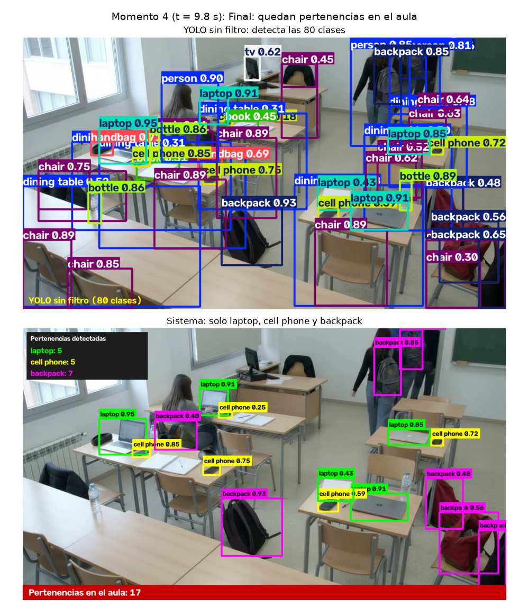

# Detección de pertenencias olvidadas en aulas con YOLO

Aplicación de visión por computadora que analiza el video de una cámara fija en un aula y muestra solo las pertenencias que los estudiantes suelen olvidar: laptops, celulares y mochilas. Usa YOLO26 con post-procesamiento propio para ignorar todo lo demás (personas, sillas, botellas, mesas, etc.).

## Resultado

Arriba, YOLO sin filtro con las 80 clases. Abajo, el sistema final con solo las 3 clases activadas.



## El problema

Al terminar una clase, es común que se queden laptops, celulares y mochilas en las aulas y laboratorios. Revisar el aula a ojo es lento y se pasan cosas por alto cuando hay muchas mesas.

Una cámara fija analiza el video y lleva la cuenta de las pertenencias en el aula, con una caja y el nombre sobre cada una, un contador por clase y el total.

Para este problema, las personas, las sillas, las mesas y las botellas no importan. Mostrarlos llenaría la imagen de cajas inútiles, por eso el sistema los ignora.

## Clases

| Estado | Clases |
|---|---|
| Activadas (3) | `laptop`, `cell phone`, `backpack` |
| Desactivadas (presentes en el video) | `person`, `chair`, `bottle`, `dining table`, `tv`, `book`, `handbag` y el resto de las 80 clases de COCO |

Las clases desactivadas aparecen en el video y YOLO sí las detecta. Es el post-procesamiento el que decide no mostrarlas.

## Cómo funciona

1. **Detección.** YOLO26 mediano analiza cada cuadro y devuelve todas las cajas de las 80 clases.
2. **Filtro.** La función `split_detections` separa las cajas en activas e ignoradas. Solo pasan las de las 3 clases elegidas que superen el umbral y el tamaño mínimo de su clase y que no estén en una zona excluida.
3. **Dibujo.** `draw_active` dibuja únicamente las activas y `draw_panel` agrega el contador por clase y el total.
4. **Comprobación.** El notebook verifica por código que nunca se dibujó una clase desactivada y que su filtro da el mismo resultado que el filtro nativo de Ultralytics (`classes=[...]`).

### Decisiones de diseño para detectar mejor

Los celulares son muy pequeños en este video. Con la configuración por defecto, YOLO nano los detectaba solo en la mitad de los cuadros y se le escapaban varios. Se resolvió así:

- **Modelo mediano.** Se usa YOLO26 en su versión `m`, que distingue mucho mejor los objetos pequeños y oscuros, como los celulares sobre las mesas y la mochila negra que queda en el piso.
- **Tres pasadas por cuadro.** Una a 1280 px con todas las clases, otra a 960 px solo para celulares y otra a 1600 px solo para mochilas, que recuperan lo que la primera no detecta, como las mochilas tapadas por una persona o una silla. Luego se unen los resultados sin repetir cajas.
- **Umbral propio por clase.** La laptop usa 0.25, el celular 0.20 y la mochila 0.18, porque YOLO les da puntajes más bajos a los objetos pequeños o tapados.
- **Tamaño mínimo para mochilas.** Se descartan las cajas de mochila demasiado pequeñas, que corresponden a objetos como un estuche.
- **Zona excluida.** Como la cámara es fija, se ignora la zona del monitor de computadora del escritorio del fondo, un equipo permanente del aula que el modelo a veces confunde con una laptop.

## Resultados

Sobre el video de prueba, de 240 cuadros:

| Clase | Cuadros donde se detecta | ¿La muestra el sistema? |
|---|---|---|
| `laptop` | 240 | Sí |
| `backpack` | 240 | Sí |
| `cell phone` | 240 | Sí |
| `person`, `chair`, `bottle` | 240 | No (ignoradas) |

En todos los cuadros hay al menos dos clases activas detectadas a la vez. En el momento inicial el sistema muestra 10 laptops, 4 celulares y 4 mochilas, y en el momento final 5 laptops, 5 celulares y 7 mochilas, entre ellas la mochila negra que queda en el piso.

## Video de prueba

Es un aula vista desde una cámara alta y fija, de 10 segundos, 1280 x 720 y 24 cuadros por segundo. Los estudiantes trabajan con sus laptops y luego salen, dejando cosas sobre las mesas. El video fue **generado con IA (Gemini)**.

## Estructura del proyecto

```
data/
    videos/
        aula.mp4                         Video de prueba
notebooks/
    pertenencias_olvidadas_yolo.ipynb    Notebook con la aplicación y la evidencia
reports/
    pertenencias_olvidadas_yolo.pdf      Notebook exportado a PDF
    evidencia_1.png a evidencia_4.png    Cuatro momentos del video
    resumen_clases.png                   Gráfica de clases detectadas e ignoradas
requirements.txt                         Dependencias de Python
README.md                                Este archivo
```

El notebook también genera `reports/aula_filtrado.mp4` y `reports/aula_comparacion.mp4`. Estos videos pesan varios MB, por eso no se suben al repositorio y se regeneran al ejecutar el notebook.

## Requisitos

- Python 3.10 o superior (se desarrolló con Python 3.14)
- Las librerías de `requirements.txt`: Ultralytics, OpenCV, NumPy, Matplotlib, Pillow, Jupyter, ipykernel, nbformat y nbconvert
- PyTorch (se instala junto con Ultralytics, aquí en su versión solo CPU)

No necesita GPU. El modelo `yolo26m.pt` pesa unos 42 MB y Ultralytics lo descarga solo la primera vez que se ejecuta. En CPU, el procesamiento del video tarda unos minutos más que con el modelo nano.

## Cómo ejecutarlo

### 1. Clonar el repositorio

```bash
git clone https://github.com/DanielSozoranga/vision-computadora-yolo-clases.git
cd vision-computadora-yolo-clases
```

### 2. Crear y activar el entorno virtual

En Linux, macOS o WSL:

```bash
python3 -m venv vision-yolo
source vision-yolo/bin/activate
```

En Windows con PowerShell:

```powershell
python -m venv vision-yolo
vision-yolo\Scripts\Activate.ps1
```

En Ubuntu o WSL puede hacer falta instalar antes el paquete de entornos virtuales:

```bash
sudo apt update && sudo apt install -y python3-venv python3-pip
```

### 3. Instalar las dependencias

Primero PyTorch en su versión solo CPU, que es mucho más liviana, y después el resto:

```bash
pip install --upgrade pip
pip install torch torchvision --index-url https://download.pytorch.org/whl/cpu
pip install -r requirements.txt
```

Para comprobar que todo quedó bien:

```bash
python -c "import ultralytics, cv2, torch; print(ultralytics.__version__, cv2.__version__, torch.__version__)"
```

### 4. Abrir y ejecutar el notebook

Registra el entorno como kernel de Jupyter:

```bash
python -m ipykernel install --user --name vision-yolo --display-name "Python (vision-yolo)"
```

Abre `notebooks/pertenencias_olvidadas_yolo.ipynb` en VS Code o con `jupyter lab`, elige el kernel `Python (vision-yolo)` y ejecuta todas las celdas con **Run All**. En CPU el procesamiento del video tarda unos minutos. Las rutas son relativas a la carpeta `notebooks/`, así que no hay que cambiar nada.

### 5. Exportar el notebook a PDF

```bash
jupyter nbconvert --to html notebooks/pertenencias_olvidadas_yolo.ipynb
```

Abre el archivo HTML generado en el navegador, elige imprimir y guarda como PDF.

## Usar otro video o otras clases

1. Copia tu video a `data/videos/` y cambia `VIDEO_PATH` en el notebook.
2. Cambia la lista `ACTIVE_CLASSES` por las clases que quieres mostrar, usando los nombres de COCO que imprime el notebook, por ejemplo `cup`, `bottle` o `book`.
3. Agrega un color por cada clase nueva en `CLASS_COLORS` y un umbral en `CLASS_CONF`.
4. Ajusta los momentos de la evidencia en `KEY_SECONDS` y sus títulos en `MOMENTS`.
